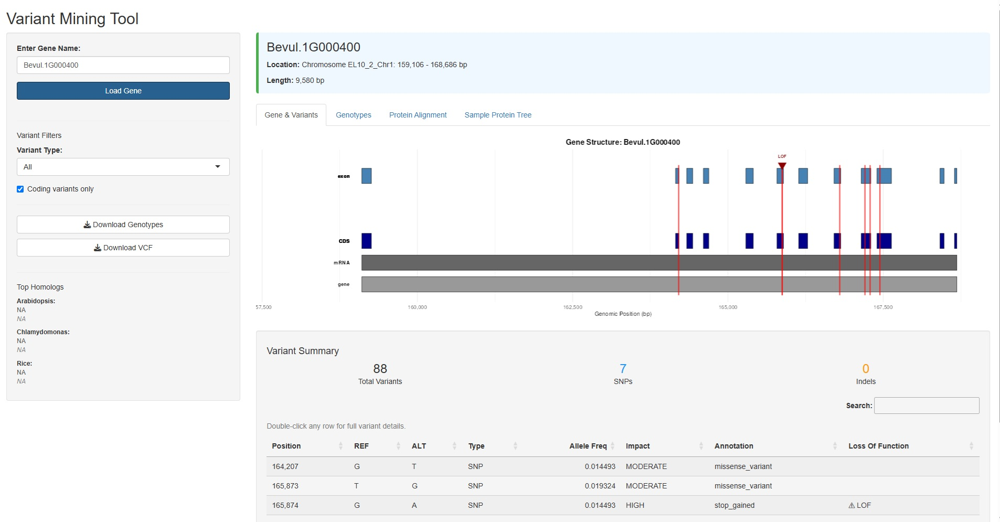
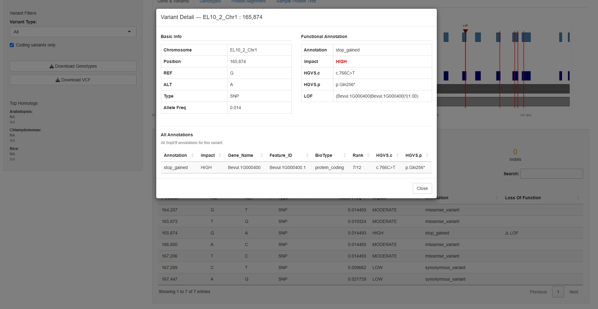
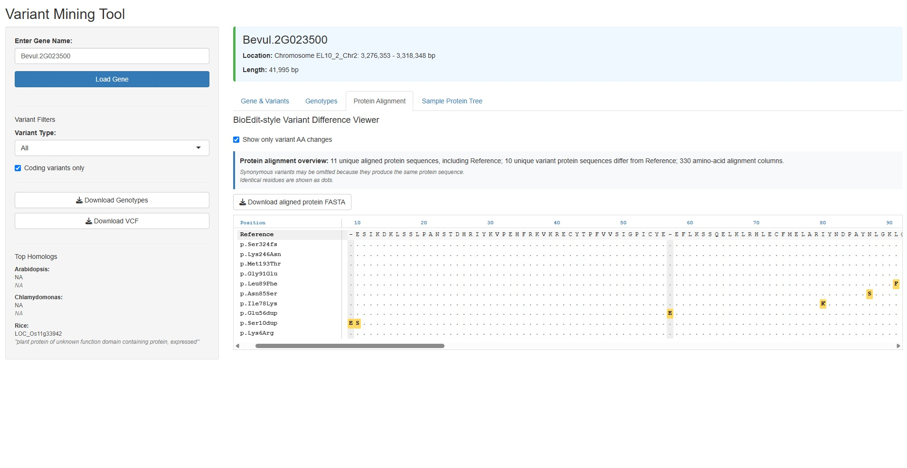
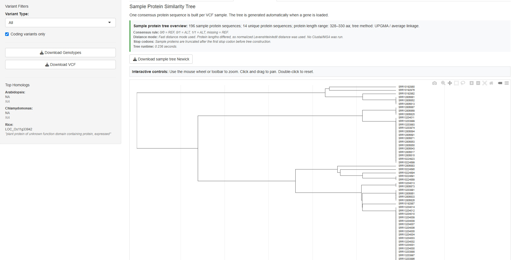

# Variant Mining Tool (VMT)

An interactive R Shiny application for querying, visualizing, and 
interpreting genomic variant data across large multi-accession datasets.
Developed at USDA Agricultural Research Service for internal use by 
plant genetics and disease resistance research teams.

## Overview

The VMT provides a queryable interface into a dataset of 16.5 million 
genomic variants across 207 wild sugar beet accessions. Rather than 
working directly with raw VCF files, researchers can filter variants by 
gene, position, or effect, then immediately explore the biological 
implications through integrated visualization and sequence analysis tools.

## Features

- **Variant querying** — fast, region-based queries into Tabix-indexed 
  VCF files with filtering by gene, variant effect, and accession
- **Functional annotation** — integration of GFF3 genome annotations 
  and SnpEff variant effect predictions
- **Protein alignment** — ClustalOmega multiple sequence alignment of 
  predicted protein sequences across selected accessions
- **Planned: similarity dendrogram** — hierarchical clustering of accessions 
  based on protein-level variant profiles, visualizing population 
  structure and grouping similar samples
- **Planned: phenotype integration** — linking variant and protein 
  similarity data to field phenotype records for genotype-phenotype 
  association analysis

## Stack

R, Shiny, Tabix, VCF/GFF3 parsing, ClustalOmega, Docker

## Status

Working prototype in active internal use. Phenotype data integration 
is the next planned development milestone.

## Data

Full dataset available on request / via USDA data sharing

## Screenshots

<figure>
  <figcaption align="center"><i>Figure 1: The genomics dashboard after searching a gene</i></figcaption>
  
</figure>

<figure>
  <figcaption align="center"><i>Figure 2: Pop-out view when double clicking a variant</i></figcaption>
  
</figure>

<figure>
  <figcaption align="center"><i>Figure 3: The predicted protein alignment dashboard for the gene and all unique variants</i></figcaption>
  
  <figtitle
</figure>

<figure>
  <figcaption align="center"><i>Figure 4: Protein similarity tree for all samples (next steps would be attaching phenotype data)</i></figcaption>
  
  <figtitle
</figure>

## Contact
Sam McNeill
Samuel.McNeill@usda.gov

June 2026
